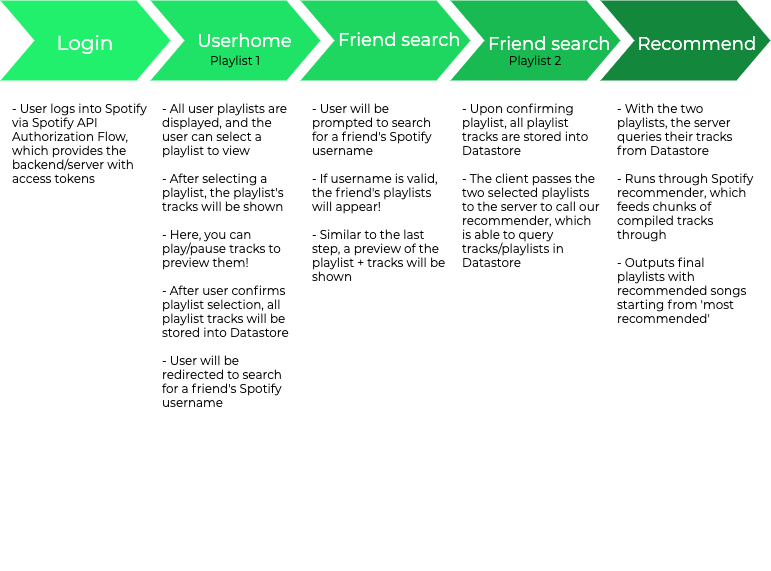
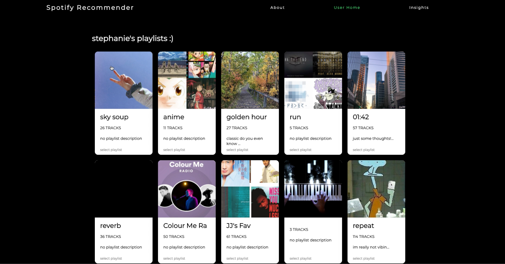
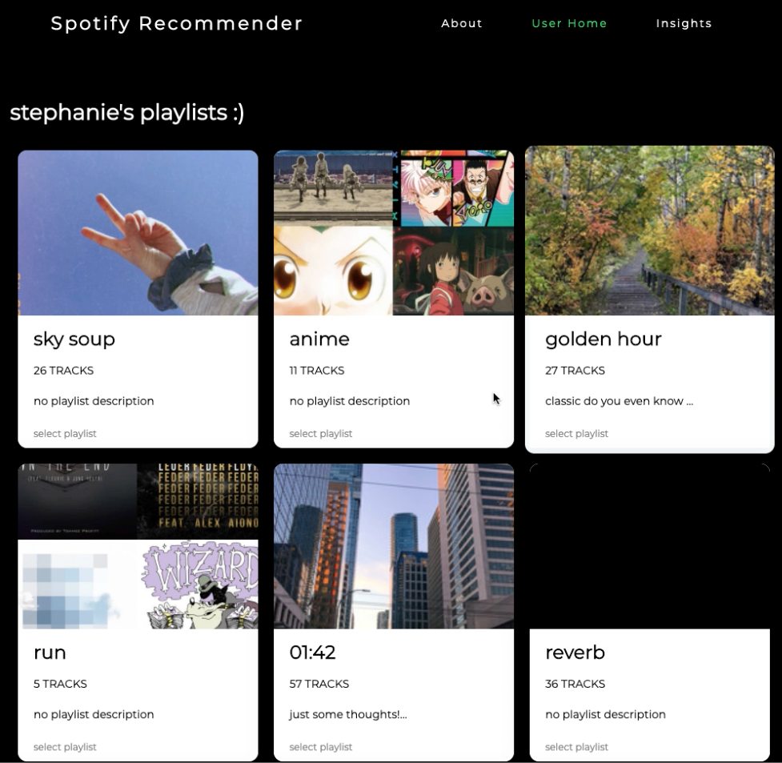
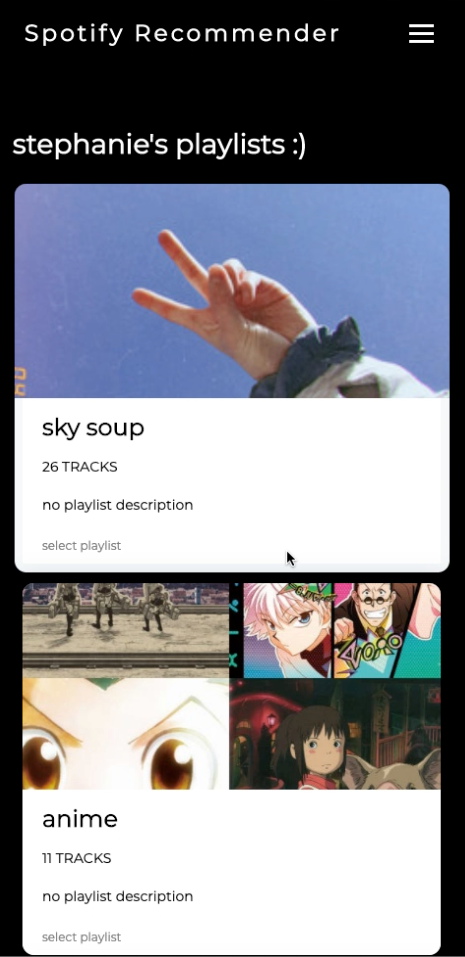
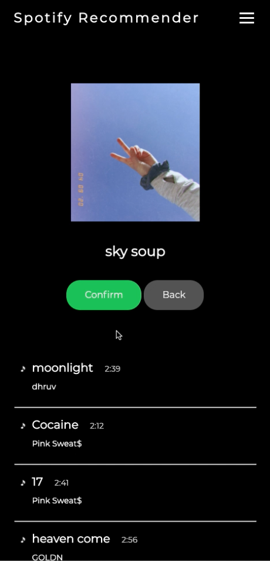

# Spotify recommender + insights

### Google SPS Taiwan Team 6

Used Javascript, Node.js/Express.js, Python, and Google Datastore to create a Spotify playlist recommender + insights web application :)

Music taste is unique to everyone and is hard to describe in words - with this app, you can compare your music preferences with friends and enjoy some new tracks!

### Video demos
You can play them in the /demo folder or **click on the images below** to watch the Youtube demos!

#### Desktop view

#### Tablet view

#### Mobile view

### Contributors
- Phoebe (UI)
    - UI beginning stages: colour palette, basic design; more responsive data population by Stephanie
    - Assisted looking into machine learning models in beginning stages
- Stephanie (Spotify API, frontend + backend)
    - Spotify API calls: login authorization flow, access tokens, get user, user playlists, playlist and track objects, personalized user insights, search Spotify user
    - Frontend: communicate with server using Javascript fetching, ie. send selected user playlists, populate DOM with playlists and data after calling API, responsive navigation + grid layout to display playlists, cookies, user login status, lots of rendering!
    - Backend: Node.js server, handles user authorization, page rendering, GET/POST requests, and Spotify API calls
    - Client-server communication: Javascript fetch, GET, POST, JSON formatting/parsing
- Jessica C (Datastore)
    - Created Datastore entities for tracks (name, artists, audio_featrures, track_id, playlist_id)
    - Implemented functions for inserting/retrieving to/from Datastore, ie. addTracks(), getTrackByPlaylist(), getTrackById()
- Jessica F (Recommender)
    - Modified Spotify's recommendation function to fit our app purpose and functionality, ex. getTracks(), getTracksByPlaylistId(), getRecommendations()
    - Ran tracks from Datastore playlists through recommendation function to output a final playlist of recommended songs starting from 'most recommended'

### To run locally 
- Git clone the repository
- You might have to delete the `node_modules` folder and run `npm install`
- Navigate to working directory/repository
- In Terminal/Powershell, run `node server.js` or `npm run devStart` (nodemon)
- Application should be running on local host port 8888!
